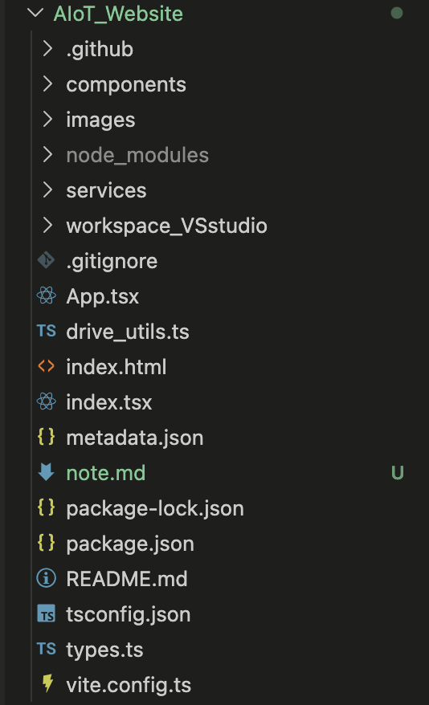
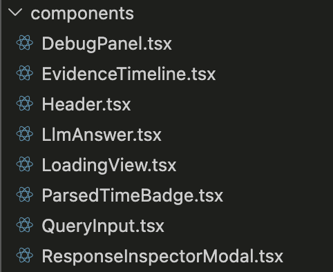

# AIoT Website Frontend Architecture Analysis

## Project Overview

AIoT Website is the frontend interface of the **Time-Aware Analytics for IoT Systems** platform.

The system provides an interactive web interface that allows users to query IoT sensor data using natural language and receive evidence-based responses generated through a Time-Aware Retrieval-Augmented Generation (TA-RAG) architecture.

### Deployment

GitHub Pages:

https://achesond77.github.io/AIoT_Website/

### Repository

https://github.com/AchesonD77/AIoT_Website

---

# Overall Architecture

The project follows a modern frontend-backend separation architecture.

```text
Browser
   │
   ▼
React Frontend (Vite + TypeScript)
   │
   ▼
API Service Layer
   │
   ▼
Python Backend
   │
   ▼
Time-Aware Retrieval Engine
   │
   ▼
FAISS Daily Indexes
```

The frontend is responsible for:

- User interaction
- Query submission
- Result visualization
- Evidence presentation
- Debugging and inspection

The backend is responsible for:

- Temporal parsing
- Retrieval planning
- FAISS retrieval
- LLM generation
- Evidence aggregation

---

# Technology Stack

## Frontend

- React
- TypeScript
- Vite

## Backend

- Python
- FAISS
- OpenAI GPT
- Time-Aware Retrieval Architecture

## Deployment

- GitHub Pages

---

# Project Structure



```text
AIoT_Website
│
├── .github
│
├── components
│
├── images
│
├── services
│
├── App.tsx
├── index.tsx
├── index.html
│
├── metadata.json
│
├── package.json
├── tsconfig.json
├── vite.config.ts
│
└── README.md
```

---

# Core Architecture Pattern

The project adopts a:

## Single Page Application (SPA)

React renders all content dynamically within a single webpage.

Advantages:

- Fast user experience
- No full-page reloads
- Interactive UI

---

## Frontend-Backend Separation

```text
Frontend
    │
    ▼
API Layer
    │
    ▼
Backend
```

Advantages:

- Independent deployment
- Easier maintenance
- Better scalability

---

## Component-Based Architecture



Each UI feature is encapsulated into an independent React component.

```text
App
│
├── Header
├── QueryInput
├── ParsedTimeBadge
├── LLMAnswer
├── EvidenceTimeline
├── ResponseInspectorModal
├── DebugPanel
└── LoadingView
```

Benefits:

- Reusable code
- Easier testing
- Better maintainability

---

# Entry Files

## index.html

The HTML entry point of the application.

Contains:

```html
<div id="root"></div>
```

React mounts the entire application into this container.

---

## index.tsx

The React application entry point.

Responsibilities:

- Initialize React
- Load App.tsx
- Mount React to the DOM

Example:

```tsx
ReactDOM.createRoot(
  document.getElementById("root")!
).render(
  <App />
);
```

---

## App.tsx

The root component of the application.

Responsibilities:

- Overall page layout
- State management
- API interactions
- Component orchestration

Acts as the central controller of the frontend system.

---

# Components

## Header.tsx

Top navigation section.

Responsible for:

- Politecnico di Milano branding
- IoTLab branding
- Navigation controls
- Search/Menu icons

Visual area:

```text
POLITECNICO MILANO
IoTLab
```

---

## QueryInput.tsx

Main query submission component.

Responsible for:

- User input
- Query submission
- Triggering backend requests

Example:

```text
Just ask, unlock insights instantly
```

---

## ParsedTimeBadge.tsx

Temporal parsing visualization component.

Displays how natural language time expressions are interpreted.

Example:

```text
User Input:
last week

Parsed Result:
2025-08-18 ~ 2025-08-24
```

Purpose:

- Explain temporal understanding
- Increase system transparency

---

## LLMAnswer.tsx

Displays the final answer generated by the LLM.

Responsible for:

- Intelligence Summary
- Natural language response rendering

Example:

```text
Poor lighting conditions were detected
between 09:00 and 11:00.
```

---

## EvidenceTimeline.tsx

Evidence visualization component.

Displays retrieved evidence chunks along a timeline.

Example:

```text
09:00
09:05
09:10
09:15
```

Purpose:

- Explainability
- Traceability
- Evidence transparency

This component directly supports the research goals of TA-RAG.

---

## ResponseInspectorModal.tsx

Developer inspection tool.

Displays raw backend JSON responses.

Example:

```json
{
  "answer": "...",
  "chunks": [...],
  "time_window": {...}
}
```

Useful for:

- Research demonstrations
- Debugging
- Validation

---

## DebugPanel.tsx

Development debugging panel.

May display:

- API latency
- Retrieval information
- Raw responses
- Diagnostic metrics

---

## LoadingView.tsx

Loading animation component.

Displayed while waiting for:

```text
User Query
    ↓
Backend Processing
    ↓
LLM Response
```

Provides a smoother user experience.

---

# Services Layer

## services/

Contains frontend service modules responsible for backend communication.

Typical structure:

```text
services
└── apiService.ts
```

Responsibilities:

- HTTP requests
- API abstraction
- Error handling

Architecture:

```text
React Components
       │
       ▼
API Service Layer
       │
       ▼
Backend API
```

This design keeps UI logic separate from networking logic.

---

# Research-Oriented Features

Unlike a traditional dashboard, this system integrates several research-oriented capabilities:

## Temporal Parsing Visualization

Shows how natural language time expressions are interpreted.

Example:

```text
"last Monday"
      ↓
2025-08-18
```

---

## Evidence Timeline

Displays retrieved evidence chronologically.

Supports:

- Explainability
- Temporal traceability
- Retrieval transparency

---

## Response Inspection

Allows developers and researchers to inspect raw retrieval and generation outputs.

Supports:

- Debugging
- Demonstrations
- Experimental validation

---

# Software Engineering Evaluation

The project demonstrates characteristics beyond a typical coursework project.

### Strengths

- Frontend-backend separation
- Component-based design
- Temporal parsing visualization
- Evidence traceability
- Debugging infrastructure
- GitHub Pages deployment
- Research-oriented architecture

### Classification

The system can be viewed as:

```text
Research Prototype
+
Conference Demonstration System
```

and serves as a practical implementation of the TA-RAG research architecture for IoT analytics.

---

# Future Improvements

Potential future extensions:

- Authentication system
- Multi-user support
- Real-time sensor streaming
- Interactive retrieval exploration
- Advanced analytics dashboard
- Mobile-responsive optimization

---

# Author

Qixun Dan

M.Sc. Telecommunication Engineering

Politecnico di Milano

IoTLab – AI and Data Analysis Research